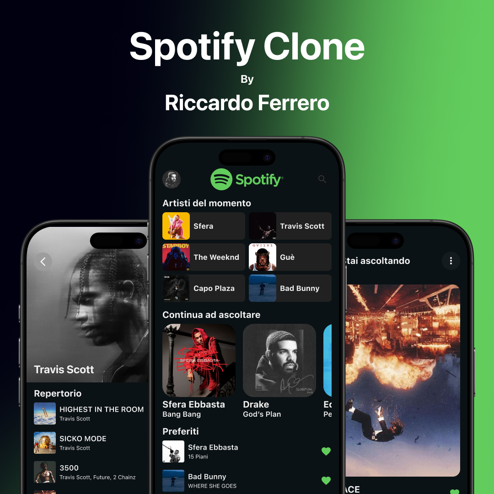
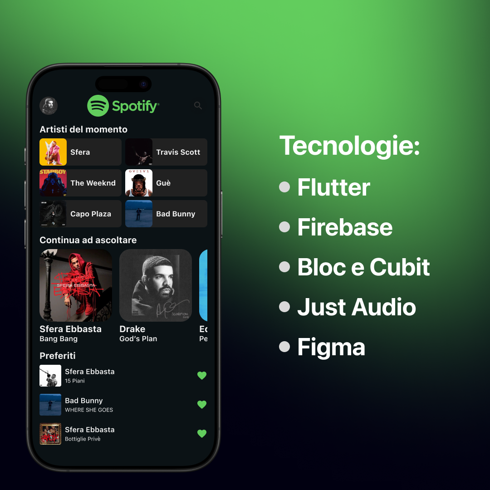

# Spotify Clone in Flutter

A replica of the Spotify app built with Flutter. This project was developed to showcase my skills in Flutter and UI/UX design and is fully open source.

## Table of Contents

- [Introduction](#introduction)
- [Features](#features)
- [Technologies Used](#technologies-used)
- [Demo](#demo)
- [Installation](#installation)
- [Usage](#usage)
- [Design and Prototyping](#design-and-prototyping)
- [Contributing](#contributing)
- [License](#license)

## Introduction

"Spotify Clone" is a mobile application developed using Flutter that simulates some of the core functionalities of Spotify, such as navigating through playlists and playing demo tracks. The goal of this project is to demonstrate a complete mobile app—focusing both on the underlying code and the user interface, which was designed in Figma.

## Features

- **Modern User Interface:** Sleek, modern design created with Figma.
- **Intuitive Navigation:** Simple and user-friendly layout for seamless app exploration.
- **Demo Music Playback:** Basic functionality to navigate and play demo tracks.
- **Open Source:** Code is available on GitHub for you to study, modify, and improve.

## Technologies Used

- **[Flutter](https://flutter.dev/):** The framework used for building the mobile application.
- **Dart:** The programming language used with Flutter.
- **[Figma](https://www.figma.com/):** The tool used for designing the user interface.
- **Git & GitHub:** For version control and sharing the code.

**Screenshot 1:**

**Screenshot 2:**
